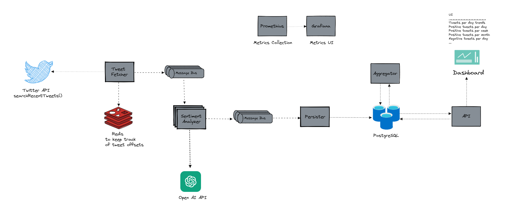

# TweetSentimentAnalyzer
The "Tweet Sentiment Analyzer" empowers the analysis of Twitter activity by Intuit users. This allows for the early identification of trends which could potentially indicate issues with the company's offerings. This key feature transforms raw data into an invaluable insights.

The derived insights provide a deeper understanding of customer sentiments and feedback, informing strategic decision-making, facilitating improvements in customer service, and optimizing product offerings. Ultimately, the analyzer plays a crucial role in enhancing customer satisfaction and strengthening the company's market position.


## Architecture diagram:



## Services
### Fetcher:
- Retrieves the most recent tweets from the Twitter API, extracts the necessary fields, and then publishes this information to rawTweetsTopic_{Keyword}.
### Sentiment-Analyzer:
- Analyzes tweets for sentiment
- Subscribes to rawTweetsTopic_{Keyword}, enriches the tweet with sentiment and subsequently publishes to enrichedTweetsTopic_{Keyword}.
- In the current implementation uses OpenAI API for the actual sentiment analysis. 
### Persister:
- This service is responsible for storing the enriched tweet data into a database.
### Aggregator:
- Runs daily aggregations on collected data and generates aggregated tables, which then are used to feed reports.
### Api:
- Exposes APIs for obtaining sentiment reports and tracking trends.
- API documentation for integration: http://localhost:8080/swagger-ui/index.html


## Setting up environment

### Postgres
```bash
docker run --name interview-intuit-twitter-postgres -e POSTGRES_PASSWORD=mysecretpassword -v C:\Temp\volumes\intuit-twiter-postgres:/var/lib/postgresql/data -p 5432:5432 -d postgres
```
Create appuser role and database for application access
```
CREATE ROLE appuser WITH LOGIN PASSWORD '';
CREATE DATABASE tweets;
GRANT ALL PRIVILEGES ON DATABASE tweets TO appuser;
GRANT ALL PRIVILEGES ON SCHEMA public TO appuser;
```

### Kafka
```
  docker run -d --name interview-intuit-twitter-kafka-broker -p 9092:9092 -e ALLOW_PLAINTEXT_LISTENER=yes -e KAFKA_CFG_ADVERTISED_LISTENERS=PLAINTEXT://localhost:9092 -v C:\Temp\volumes\intuit-twitter-kafka-data:/bitnami/kafka bitnami/kafka:latest
  ```

### Redis
```
docker run --name interview-intuit-twitter-redis -d -p 6379:6379 redis
```

Make sure all services are up and running:
```
>docker ps
CONTAINER ID   IMAGE                  COMMAND                  CREATED          STATUS          PORTS                    NAMES
45c6440f0e58   redis                  "docker-entrypoint.s…"   23 seconds ago   Up 20 seconds   0.0.0.0:6379->6379/tcp   interview-intuit-twitter-redis
4d6b67fc08c9   bitnami/kafka:latest   "/opt/bitnami/script…"   45 hours ago     Up 36 hours     0.0.0.0:9092->9092/tcp   interview-intuit-twitter-kafka-broker
4fcbc6d8abca   postgres               "docker-entrypoint.s…"   2 days ago       Up 36 hours     0.0.0.0:5432->5432/tcp   interview-intuit-twitter-postgres
```


### How to build docker images locally
```
mvn spring-boot:build-image -DskipTests
```
